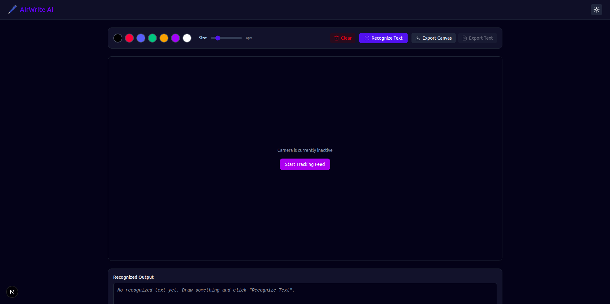
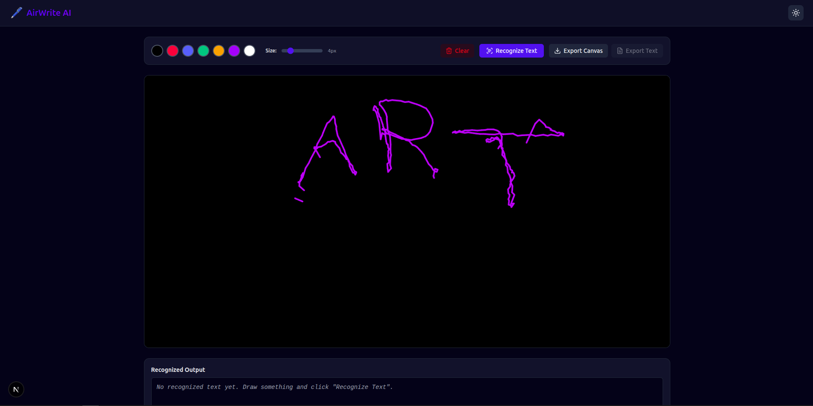

# 🖌️ AirWrite AI

> **Write in the Air. Convert to Text with AI.**

AirWrite AI is a full-stack AI-powered web application that allows users to write or draw in the air using their webcam. It uses **Google MediaPipe** for real-time hand tracking and **Tesseract OCR** to recognize handwritten text from a virtual canvas.

This project combines **Computer Vision**, **Optical Character Recognition (OCR)**, and **Modern Web Development** to create an interactive and intelligent handwriting recognition system.

---

## 🚀 Features

- ✋ Real-time hand tracking using Google MediaPipe
- 🎥 Live webcam integration
- 🎨 Virtual drawing canvas
- 🖍️ Multiple brush colors
- 📏 Adjustable brush size
- 🧹 Clear canvas option
- 🤖 AI-powered handwritten text recognition
- 📄 Export canvas as an image
- 🌙 Modern responsive UI with dark mode
- ⚡ Fast communication between frontend and backend
- 🐳 Docker support for backend deployment

---

## 🛠️ Tech Stack

### Frontend
- Next.js
- React
- TypeScript
- Tailwind CSS

### Backend
- Python
- Flask
- OpenCV
- Google MediaPipe
- Tesseract OCR

### Tools
- Docker
- Git
- npm
- pip

---

# 📂 Project Structure

```text
airwrite-ai/
│
├── backend/
│   ├── app.py
│   ├── inference.py
│   ├── model.py
│   ├── ocr.py
│   ├── utils.py
│   ├── requirements.txt
│   ├── Dockerfile
│   ├── models/
│   └── venv/
│
└── frontend/
    ├── app/
    ├── components/
    ├── hooks/
    ├── lib/
    ├── public/
    ├── package.json
    ├── package-lock.json
    ├── next.config.js
    ├── tailwind.config.js
    ├── postcss.config.js
    ├── tsconfig.json
    └── eslint.config.js
```

---

# ⚙️ Installation

## Clone the Repository

```bash
git clone https://github.com/your-username/airwrite-ai.git

cd airwrite-ai
```

---

# 📋 Prerequisites

For Ubuntu / Linux Mint:

```bash
sudo apt update

sudo apt install -y \
tesseract-ocr \
libtesseract-dev \
ffmpeg \
libgl1-mesa-glx
```

---

# 🚀 Backend Setup

Navigate to the backend folder.

```bash
cd backend
```

Create a virtual environment.

```bash
python3 -m venv venv
```

Activate it.

```bash
source venv/bin/activate
```

Install dependencies.

```bash
pip install -r requirements.txt
```

Run the backend.

```bash
python app.py
```

The backend runs at:

```
http://127.0.0.1:5000
```

---

# 💻 Frontend Setup

Open another terminal.

```bash
cd frontend

npm install

npm run dev
```

Open:

```
http://localhost:3000
```

---

# 🐳 Docker (Backend)

Build Docker image

```bash
docker build -t airwrite-ai-backend .
```

Run Docker container

```bash
docker run -p 5000:5000 airwrite-ai-backend
```

---

# 💡 How to Use

1. Start the backend server.
2. Start the frontend.
3. Open **http://localhost:3000**
4. Allow webcam permissions.
5. Raise your index finger.
6. Write letters or words in the air.
7. Click **Recognize Text**.
8. The recognized text will appear below the canvas.

---

# 🔄 Workflow

```text
          Webcam
             │
             ▼
   MediaPipe Hand Tracking
             │
             ▼
     Virtual Drawing Canvas
             │
             ▼
      Capture Canvas Image
             │
             ▼
         Flask Backend
             │
             ▼
      Tesseract OCR Engine
             │
             ▼
      Recognized Text Output
```

---

# 📸 Screenshots

## Home Page



---

## OCR Result



---

# 🌟 Future Enhancements

- Improve handwriting recognition accuracy
- Multi-language OCR support
- AI handwriting correction
- Save OCR history
- User authentication
- Mobile support
- Cloud deployment
- Gesture-based commands

---

